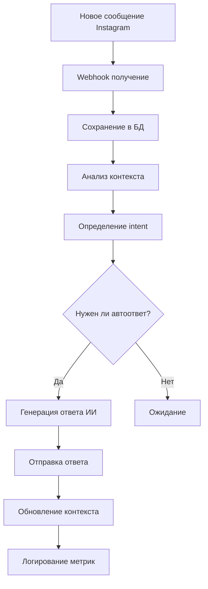

# 🏗️ Архитектура ИИ Instagram Bot

## 📋 Недостающие компоненты для ИИ

### 🗄️ База данных (критично)
```sql
-- Пользователи
CREATE TABLE users (
    id SERIAL PRIMARY KEY,
    instagram_user_id BIGINT UNIQUE,
    username VARCHAR(100),
    profile_data JSONB,
    preferences JSONB,
    created_at TIMESTAMP DEFAULT NOW()
);

-- Диалоги с контекстом
CREATE TABLE conversations (
    id UUID PRIMARY KEY,
    instagram_thread_id VARCHAR(100) UNIQUE,
    user_id INTEGER REFERENCES users(id),
    context JSONB,  -- Контекст для ИИ
    summary TEXT,   -- Краткое изложение
    sentiment VARCHAR(20),
    status VARCHAR(20) DEFAULT 'active',
    created_at TIMESTAMP DEFAULT NOW()
);

-- Сообщения с ИИ метаданными
CREATE TABLE messages (
    id UUID PRIMARY KEY,
    conversation_id UUID REFERENCES conversations(id),
    content TEXT,
    sender_type VARCHAR(10), -- 'user' or 'bot'
    ai_confidence FLOAT,
    sentiment VARCHAR(20),
    intent VARCHAR(50),
    metadata JSONB,
    created_at TIMESTAMP DEFAULT NOW()
);

-- Планы и задачи агента
CREATE TABLE agent_plans (
    id UUID PRIMARY KEY,
    name VARCHAR(200),
    goal TEXT,
    steps JSONB,
    status VARCHAR(20),
    progress FLOAT DEFAULT 0.0,
    created_at TIMESTAMP DEFAULT NOW()
);
```

### 🧠 ИИ Сервис
```python
class AIService:
    def __init__(self):
        self.openai_client = OpenAI(api_key=settings.OPENAI_API_KEY)
        self.claude_client = Anthropic(api_key=settings.CLAUDE_API_KEY)
    
    async def generate_response(self, conversation_context: str, user_message: str) -> str:
        # Генерация ответа с учетом контекста
        
    async def analyze_sentiment(self, text: str) -> dict:
        # Анализ эмоций
        
    async def extract_intent(self, text: str) -> str:
        # Определение намерений пользователя
```

### 🤖 Агент Сервис  
```python
class AgentService:
    async def create_plan(self, goal: str, constraints: list) -> dict:
        # Создание плана действий
        
    async def execute_plan(self, plan_id: str) -> dict:
        # Выполнение плана
        
    async def auto_reply(self, message: Message) -> Optional[str]:
        # Автоматические ответы по правилам
```

## 🚀 Новые эндпоинты

### ИИ Чат-бот эндпоинты:
```python
# Контекст и память
GET /api/v1/conversations/{id}/context
PUT /api/v1/conversations/{id}/context
GET /api/v1/conversations/{id}/history?limit=50
POST /api/v1/conversations/{id}/ai-reply

# ИИ сервисы
POST /api/v1/ai/chat-completion
POST /api/v1/ai/analyze-sentiment  
POST /api/v1/ai/extract-intent
GET /api/v1/ai/models

# Real-time
WS /ws/conversations/{id}
POST /webhooks/instagram/messages
```

### ИИ Агент эндпоинты:
```python
# Планирование
POST /api/v1/agent/plans
GET /api/v1/agent/plans/{id}/status
POST /api/v1/agent/plans/{id}/execute

# Автоматизация
POST /api/v1/agent/rules
GET /api/v1/agent/tasks/active
POST /api/v1/agent/schedule

# Аналитика
GET /api/v1/analytics/conversations
GET /api/v1/analytics/users
GET /api/v1/agent/performance
```

### Управление пользователями:
```python
GET /api/v1/users/{instagram_id}/profile
PUT /api/v1/users/{id}/preferences  
GET /api/v1/users/{id}/conversation-history
POST /api/v1/users/segment
```

## 🔧 Технологический стек

### Основные компоненты:
- **PostgreSQL** - основная БД для структурированных данных
- **Redis** - кэш контекста диалогов и сессий
- **Celery** - фоновые задачи (обработка сообщений, планы агента)
- **WebSocket** - real-time уведомления
- **Elasticsearch** - поиск по истории диалогов

### ИИ интеграция:
- **OpenAI GPT-4** - основная модель для диалогов
- **Claude** - альтернативная модель
- **Local LLM** - для приватных данных
- **Embedding models** - для семантического поиска

## 📊 Мониторинг и аналитика

```python
# Метрики для отслеживания:
- Время ответа ИИ
- Качество ответов (feedback от пользователей)
- Количество успешных диалогов
- Конверсии от бота к продажам
- Использование ресурсов ИИ
```

## 🔄 Жизненный цикл сообщения



## 🎯 Приоритеты внедрения

### Фаза 1 (критично):
1. ✅ База данных PostgreSQL + миграции
2. ✅ Эндпоинты для истории сообщений
3. ✅ Базовая интеграция с OpenAI
4. ✅ Webhook для получения новых сообщений

### Фаза 2 (важно):
5. ✅ Контекст диалогов и память
6. ✅ Анализ sentiment и intent
7. ✅ WebSocket для real-time
8. ✅ Базовые правила автоответа

### Фаза 3 (расширенно):
9. ✅ Планирование задач агента
10. ✅ Аналитика и мониторинг
11. ✅ Сегментация пользователей
12. ✅ A/B тестирование ответов

## 🚀 Docker Compose обновление

```yaml
services:
  app:
    build: .
    depends_on: [postgres, redis]
    
  postgres:
    image: postgres:15
    environment:
      POSTGRES_DB: instagram_ai
      
  redis:
    image: redis:7-alpine
    
  celery-worker:
    build: .
    command: celery -A app.tasks worker
    
  celery-beat:
    build: .  
    command: celery -A app.tasks beat
```